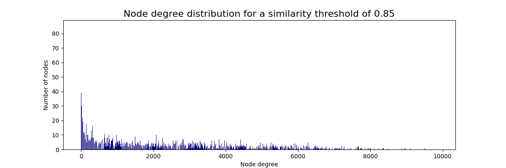
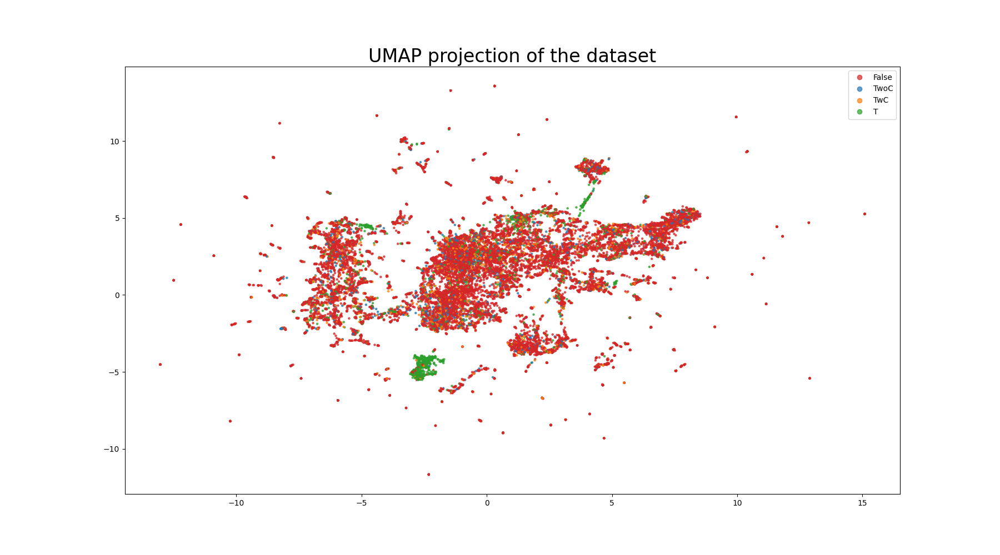
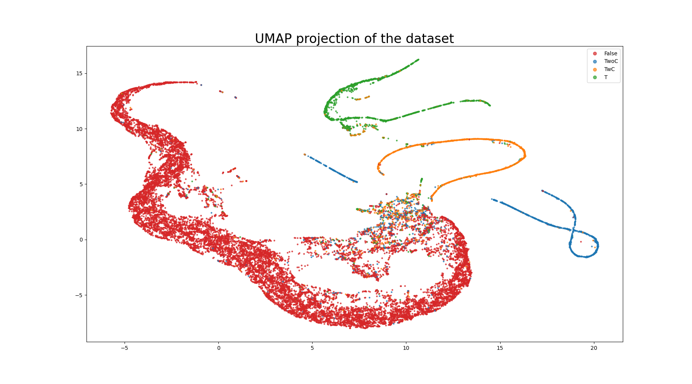

# Leveraging Graph Structures to Detect Hallucinations in Large Language Models
Welcome to the GitHub repository for the research project conducted at the University of Amsterdam, focusing on "Leveraging Graph Structures to Detect Hallucinations in Large Language Models." This project explores approaches to enhance the trustworthiness of large language models by leveraging graph structures for the detection and mitigation of hallucinations. This README has the specifics on how to use the files regarding the graph structures and networks.

## Generating Node Features and Edges
To create node features and edges from the retrieval augmented generated answers, using the `make_graph.py` script. This script offers various options to customize the graph generation process. Using the BERT-based-uncased model to generate the node features, we use cosine similarity to construct edges between nodes. If the similarity is higher than 0.85 the nodes connect. This gives us a good balance between connectivity and being fully-connected. The plot show the node degree distribution when using a 0.85 similarity threshold.



### Usage
To build graph, use the following command:
```bash
python make_graph.py [arguments]
```

### Arguments
```bash
--use-cuda: Use GPU acceleration if available (default: False)
--path <path_to_data>: Set the path to the data directory (default: "../data/")
--model_name <model>: Specify the name of the model used to embed sentences (default: "bert-base-uncased")
--threshold <value>: Set the similarity threshold to form an edge (default: 0.85)
--distances: Use pre-calculated distances matrix (default: False)
```

## Contrastive Learning
The code implementing contrastive learning utilizes the train node features to train a compact MLP (multilayer perceptron) that reduces the dimensionality from 768 node features to 128 dimensions, the CL-MLP.

### Usage
To execute the contrastive learning code, use the following command:
```bash
python contrastive_learning.py [arguments]
```

### Arguments
```bash
--use-cuda: Enable GPU acceleration if available (default: False)
--path <path_to_data>: Set the path to the data folder (default: "../data/")
--output_dir <output_directory>: Specify the path to save the model weights (default: "../weights/")
--epochs <num_epochs>: Define the number of epochs to train the model (default: 1000)
--batch-size <batch_size>: Set the batch size used during training and evaluation (default: 256)
--save-model: Toggle to save the model weights (default: False)
```

## Training with CL-MLP Embedder and GAT Model
The `train_graph.py` script employs the Contrastive Learning Multi-Layer Perceptron (CL-MLP) as an embedder and integrates it with a Graph Attention Network (GAT) model. The training is conducted on the train set, and multiple metrics are assessed on the validation set. Additionally, if desired, the script allows for saving the model based on the highest recall achieved on the validation set.

### Usage

To execute the training script, utilize the following command:
```bash
python train_graph.py [arguments]
```

### Arguments
```bash
--use-cuda: Enable GPU acceleration if available (default: False)
--path <path_to_data>: Set the path to the data folder (default: "../data/")
--output_dir <output_directory>: Specify the path to save the model weights (default: "../weights/")
--epochs <num_epochs>: Define the number of epochs to train the model (default: 500)
--optimizer <optimizer_type>: Choose the optimizer for training (choices: "SGD", "Adam", default: "Adam")
--learning-rate <lr>: Set the learning rate for the optimizer (default: 1e-3)
--save-model: Toggle to save the best model weights based on the highest recall on validation (default: False)
```

## Evaluate GAT Model
The `evaluate_graph.py` script employs the Contrastive Learning MultiLayer Perceptron (CL-MLP) as an embedder and integrates it with a Graph Attention Network (GAT) model. The validating is conducted on the train, val, or test set.

### Usage

To execute the training script, utilize the following command:
```bash
python evaluate_graph.py [arguments]
```

### Arguments
```bash
--use-cuda: Enable GPU acceleration if available (default: False)
--path <path_to_data>: Set the path to the data folder (default: "../data/")
--load-model <path-to-model-weights>: Specify the path to load the model weights (default: "../weights/GAT_379.pt")
--mode <set-to-validate-on>: Define the set on which to validate (default: "val")
```

## Visualize
To show the power of CL we add `visualize.py` to create a UMAP projection of the dataset before and after contrastive learning. This allows us to clearly show the effect of CL.
### Before CL


### After CL


### Usage

To execute the script, utilize the following command:
```bash
python visualize_graph.py [arguments]
```

### Arguments
```bash
--use-cuda: Enable GPU acceleration if available (default: False)
--path <path_to_data>: Set the path to the data folder (default: "../data/")
--output_dir <output_directory>: Specify the path to save the plot (default: "images/")
```

## k-Nearest Neighbours
As part of our ablation studies, we perform an ablation study with the CL-learned embeddings and kNN. 

### Usage

To execute the script, utilize the following command:
```bash
python kNN.py [arguments]
```

### Arguments
```bash
--use-cuda: Enable GPU acceleration if available (default: False)
--output_dir <output_directory>: Specify the path to save model weights (default: "../weights/")
--path <path_to_data>: Set the path to the data folder (default: "../data/")
--k <value>: Define the value of k in kNN (default: 5)
--combined: Use both train and validation datasets (default: False)
--full: Utilize train and validation datasets, and test on the train dataset (default: False)
```

## Authors

This research project is a collaborative effort by Sergei Agaronian & Noa Nonkes, supervised by Roxana Petcu, from the University of Amsterdam.
